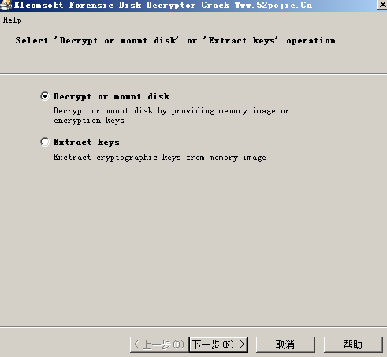
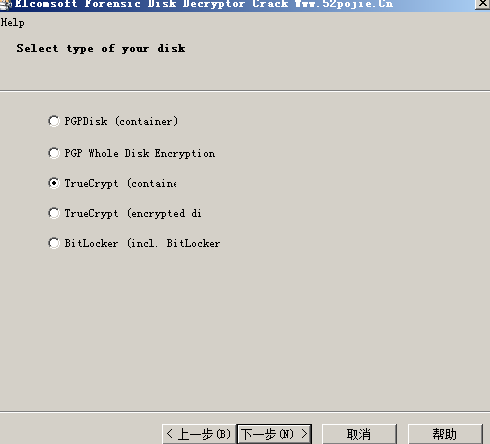
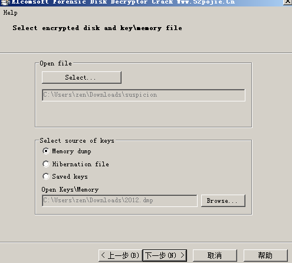
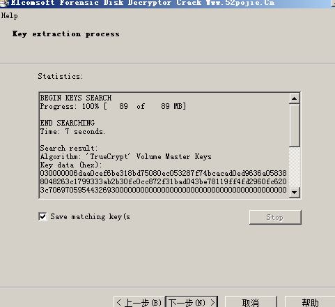
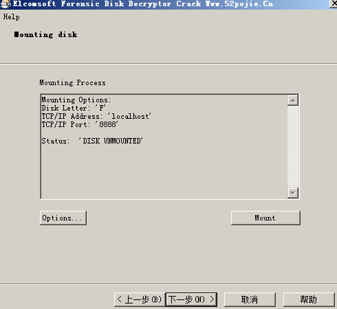
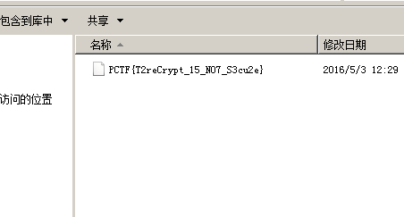

以[jarvisoj 取证2](http://pan.baidu.com/s/1c2BIGLE)为例进行分析

在使用`volatility`导出`TrueCrypt.exe`后,利用`Elcomsoft Forensic Disk Decryptor`对`suspicion`进行处理

1. 首先在导出的内存镜像中搜索key
   
    

2. 选择`TrueCrypt(container)`
   
    

3. 解密并导出`evk`文件
   
    

4. 加载虚拟磁盘
   
    

5. 在虚拟磁盘中得到flag
   
    

    