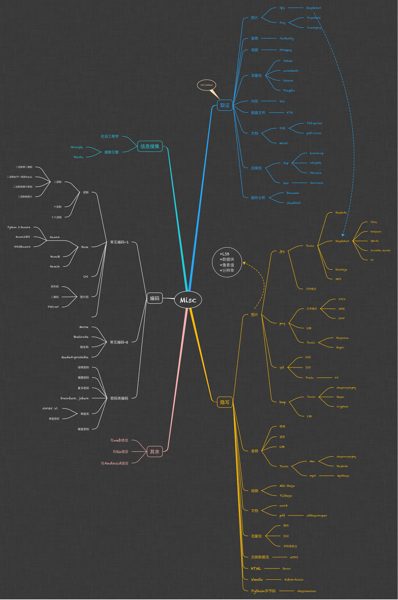
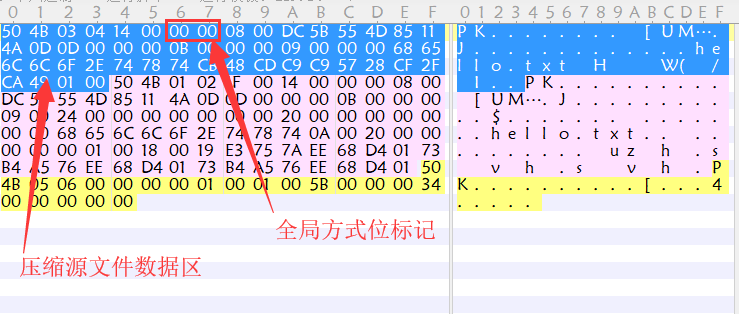
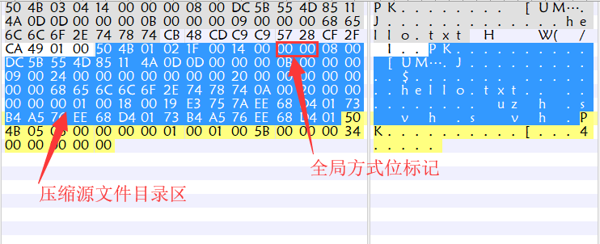
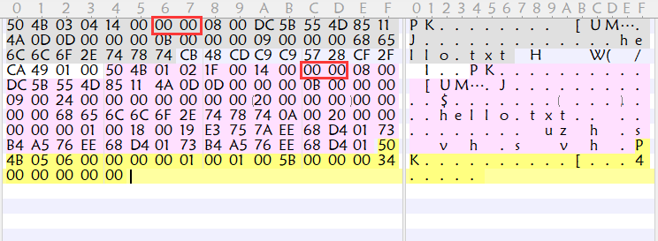
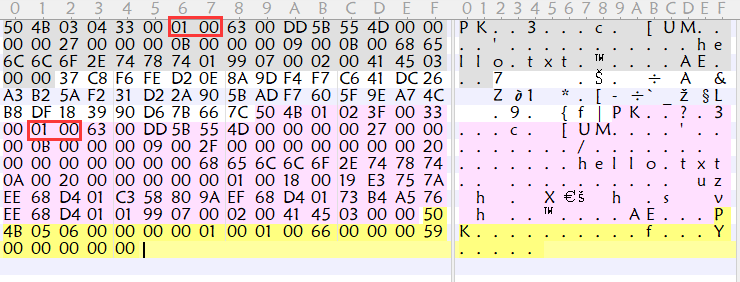
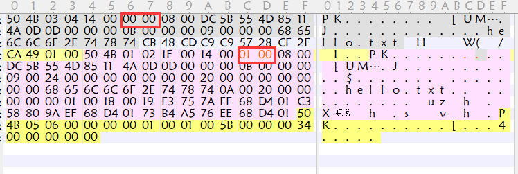

# 对Misc题的总结与记录 #



### pyc离线反编译 ###

[源地址](https://github.com/rocky/python-uncompyle6/)

`uncompyle6 *.pyc > *.py`

### Shellcodeexec ###

[源地址](https://github.com/inquisb/shellcodeexec)

***例题***

[PCTF 2016(jarvisoj)](https://dn.jarvisoj.com/challengefiles/shellcode.06f28b9c8f53b0e86572dbc9ed3346bc)

***Sample***


### 利用cloacked-pixel进行LSB隐写提取 ###

[源地址](https://github.com/livz/cloacked-pixel)

提取：

`python lsb.py extract a.png out keyword(秘钥)`

a.png位于cloacked-pixel文件夹中

### 一种用于在Python字节码中嵌入Payload的隐写工具 – Stegosaurus ###

[源地址](https://bitbucket.org/jherron/stegosaurus/src)

用法：`python3 Stegosaurus.py -x *.pyc`

[参考链接](https://www.freebuf.com/sectool/129357.html)


### 音频类隐写 ###

1.使用Audacity进行分析，多留意频谱图以及音频的开头和结尾是否存在杂音

2.使用multimon-ng来解码

	例题：bsidessf-ctf-2017 latlong
	得到一个 wav 文件，用 soxi 查看音频文件的格式
	soxi *.wav
	
	将 wav 文件转换成 raw 文件
	sox -t wav *.wav -esigned-integer -b16 -r 22050 -t raw out.raw

	multimon解码
	multimon -t raw -a AFSK1200 a.raw

### dd分割和cat合并 ###
dd的作用是转换和拷贝文件，我们可以利用它来分割文件，相关的选项如下：

if=filename：输入的文件名

of=finename：输出的文件名

bs=bytes：一次读写的字节数，默认是512bytes(做题时通常设置成1)

skip=blocks:拷贝前，跳过的输入文件的前blocks块，块的大小有bs决定(主要由binwalk的分析结果决定)

`dd if=filein of=fileout bs=1 skip=12345`

用cat将两个文件合并

`cat file1 file2 > file3`

### 二维码&条形码&PDF417 ###
[在线扫描](https://online-barcode-reader.inliteresearch.com/)


### 数字密码表 ###

安恒11月月赛


### 元数据 ###

[攻防世界 Mysterious-GIF(breakin-ctf-2017)](https://adworld.xctf.org.cn/task/answer?type=misc&number=1&grade=1&id=5557&page=5)


```
binwalk a.gif 

DECIMAL       HEXADECIMAL     DESCRIPTION
--------------------------------------------------------------------------------
0             0x0             GIF image data, version "89a", 440 x 608
2670386       0x28BF32        Zip archive data, at least v1.0 to extract, compressed size: 112890, uncompressed size: 112890, name: temp.zip
2783320       0x2A7858        End of Zip archive
2783420       0x2A78BC        End of Zip archive
```

将压缩包从`gif`中分离，将`temp.zip`解压，得到共265个enc文件，enc文件大小为256字节，这是使用rsa公钥加密文件时创建的加密文件的大小。

现在要从`gif`文件中找到私钥来进行解密

使用identify前要安装imagemagick

```
sudo apt-get install imagemagick
```

```
identify -format "%c" a.gif
```

得到
```
4d494945767749424144414e42676b71686b6947397730424151454641415343424b6b776767536c41674541416f4942415144644d4e624c35715657694351725832773639712f377933536849507565707478664177525162524f72653330633655772f6f4b3877655a547834346d30414c6f75685634364b63514a6b68727167384f79337335593546563177434b3736367532574c775672574d49554a47316a4444725276595049635135557143703545445143696f524d4763555a45673275766c3134324c44424161654f4c7a464d3465324a637a532b307238356d5052724353786a4c4b4c614c774949516e5a58497058535552562f776a6877575231664a474738512b7563454170615873634e435546343462506d344850434a2f306d7244435457482f59324350564a6b4e6b2b6f305637564f74484b734d4c344e434e414a483434572f4952774a6e744e572b4e3848726770526b467567686d4e6a63776c456b7274554b4731735243792f2f57687544756e5632706853525176486f74425a76796441674d424141454367674542414a79614e336d6c6b756e772b617137704b5561677636437a6442477964394a78447941706b314b374f493854426873464d2f33744246654131592f41762b7568434c727967726b4279652f6963372f2b30356f3853392b65674d6b52584e484b41757952336752696b77597678454b634a676a5a5a4c524656794159372f6c477634774e42683362495044664631446739737a596e6b774948396c4c454679656d4d3734416941596c63716456645a49452f6271325a344a4f307439484367485a4e6651374a645266656a4e4a51565955443031517535644d744f523465494d6462576b6862565877325445304837785178746a7754367a557270714576764f376533464845734249583635565258524c6276394f6f61794a786352715838654a6b5269344c2f597a6f344b5470456d6b64754a4c58734677743361715154626a5a48584f6c5454344e45647348327030547343414543675945412f653162737a4f3061312b63426144516a514f2b50763942734a464442336f314c477555484d4e53384644706e334a3436556b59796b353276496130763454636a715353484e4976585730544445556b624e4641314870557856786c7730426965656838426733486658795142685876645444376b306c73446d4d456f3455504b59533644356359577972776864356e4344304c72786562674f373552784c35514549452b34435649516b4367594541337638522f584b52564a50453461456567377051347554766346786a454e4e65787866364b34787059344c6639636c49766465635268433274314864522b7853756c552f52536152727a4863773378672b4c31754f3073317435533766336e753361696849586b636747537158435a3156487a426d65433430545673664179627337714a30785936543571384d6e78324f62355a336c49477579686a655661744649493253647a324a2f55436759454174654131357a516f6a53504e482b62676d62424e717465763247556a536f374932556b777243316e45595153346362665064444364643066684d6444585534766e2b66575539686b58706d4b7043592b416363626c56554e744e4d4b6649423453484d78716a426961386f31616e5a35726b6e6f5638576d4a4f50645a6259666478422f4b4432454434444243464756494c79417975657731506657436f64586969502f5a356a67742b6b4367594541727378716f61306f316f3975695237752b48735835494e6f5854394f4f475933715144576a55526e61435779774d756a525979355a774b363930416f6f4c5253744e555633334b3453416868384b7153714f6830652b34636b5762354170666c38634b3561362b76383854303958384141645935504247335465622b7673357a54704d75626c54434b4a773259617a4754385579564e38666635334e4f3951426f4533686d45796f642f4543675941396b307879434a7a6376654b6478727936706a51786b39465a7a3341744570316f635635566f776167562b4f4e657a2f4863634638474a4f384244716c5036586b634c5574736e70367459526545494349484b7735432b667741586c4649746d30396145565458772b787a4c4a623253723667415450574d35715661756278667362356d58482f77443969434c684a536f724b3052485a6b745062457335797444737142486435504646773d3d
```

将其从hex转换为ascii，得到base64

```
MIIEvwIBADANBgkqhkiG9w0BAQEFAASCBKkwggSlAgEAAoIBAQDdMNbL5qVWiCQr
X2w69q/7y3ShIPueptxfAwRQbROre30c6Uw/oK8weZTx44m0ALouhV46KcQJkhrq
g8Oy3s5Y5FV1wCK766u2WLwVrWMIUJG1jDDrRvYPIcQ5UqCp5EDQCioRMGcUZEg2
uvl142LDBAaeOLzFM4e2JczS+0r85mPRrCSxjLKLaLwIIQnZXIpXSURV/wjhwWR1
fJGG8Q+ucEApaXscNCUF44bPm4HPCJ/0mrDCTWH/Y2CPVJkNk+o0V7VOtHKsML4N
CNAJH44W/IRwJntNW+N8HrgpRkFughmNjcwlEkrtUKG1sRCy//WhuDunV2phSRQv
HotBZvydAgMBAAECggEBAJyaN3mlkunw+aq7pKUagv6CzdBGyd9JxDyApk1K7OI8
TBhsFM/3tBFeA1Y/Av+uhCLrygrkBye/ic7/+05o8S9+egMkRXNHKAuyR3gRikwY
vxEKcJgjZZLRFVyAY7/lGv4wNBh3bIPDfF1Dg9szYnkwIH9lLEFyemM74AiAYlcq
dVdZIE/bq2Z4JO0t9HCgHZNfQ7JdRfejNJQVYUD01Qu5dMtOR4eIMdbWkhbVXw2T
E0H7xQxtjwT6zUrpqEvvO7e3FHEsBIX65VRXRLbv9OoayJxcRqX8eJkRi4L/Yzo4
KTpEmkduJLXsFwt3aqQTbjZHXOlTT4NEdsH2p0TsCAECgYEA/e1bszO0a1+cBaDQ
jQO+Pv9BsJFDB3o1LGuUHMNS8FDpn3J46UkYyk52vIa0v4TcjqSSHNIvXW0TDEUk
bNFA1HpUxVxlw0Bieeh8Bg3HfXyQBhXvdTD7k0lsDmMEo4UPKYS6D5cYWyrwhd5n
CD0LrxebgO75RxL5QEIE+4CVIQkCgYEA3v8R/XKRVJPE4aEeg7pQ4uTvcFxjENNe
xxf6K4xpY4Lf9clIvdecRhC2t1HdR+xSulU/RSaRrzHcw3xg+L1uO0s1t5S7f3nu
3aihIXkcgGSqXCZ1VHzBmeC40TVsfAybs7qJ0xY6T5q8Mnx2Ob5Z3lIGuyhjeVat
FII2Sdz2J/UCgYEAteA15zQojSPNH+bgmbBNqtev2GUjSo7I2UkwrC1nEYQS4cbf
PdDCdd0fhMdDXU4vn+fWU9hkXpmKpCY+AccblVUNtNMKfIB4SHMxqjBia8o1anZ5
rknoV8WmJOPdZbYfdxB/KD2ED4DBCFGVILyAyuew1PfWCodXiiP/Z5jgt+kCgYEA
rsxqoa0o1o9uiR7u+HsX5INoXT9OOGY3qQDWjURnaCWywMujRYy5ZwK690AooLRS
tNUV33K4SAhh8KqSqOh0e+4ckWb5Apfl8cK5a6+v88T09X8AAdY5PBG3Teb+vs5z
TpMublTCKJw2YazGT8UyVN8ff53NO9QBoE3hmEyod/ECgYA9k0xyCJzcveKdxry6
pjQxk9FZz3AtEp1ocV5VowagV+ONez/HccF8GJO8BDqlP6XkcLUtsnp6tYReEICI
HKw5C+fwAXlFItm09aEVTXw+xzLJb2Sr6gATPWM5qVaubxfsb5mXH/wD9iCLhJSo
rK0RHZktPbEs5ytDsqBHd5PFFw==
```

将其解码`base64 -d -i asdf > 123`

对`123`进行分析，得知`123`是der形式的秘钥而不是默认的pem格式

```
binwalk 123

DECIMAL       HEXADECIMAL     DESCRIPTION
--------------------------------------------------------------------------------
0             0x0             Private key in DER format (PKCS header length: 4, sequence length: 1215
26            0x1A            Private key in DER format (PKCS header length: 4, sequence length: 1189
```

使用`123`对`enc`文件解密

```
for i in *;
> do
> openssl rsautl -decrypt -keyform der -inkey /home/zen/下载/_a.gif.extracted/123 -in $i >> out
> done
```

发现`out`是jpg文件，打开即可得到flag


[identify -format 各个参数具体意义](https://www.imagemagick.org/script/escape.php)(主要使用的有%s,%c,%T)

### 培根密码 ###

常见的培根加密方式有

1. 一段正常的文本，调整单词中的字母的大小写，将明文隐藏在大小写中，在解密时，把大写字母当做'A',把小写字母当做'B'(或者把大写字母当做'B',把小写字母当做'A')
2. 一段正常的文本，调整单词中的字母的字体样式

	[培根密码-维基百科-例子](https://zh.wikipedia.org/wiki/%E5%9F%B9%E6%A0%B9%E5%AF%86%E7%A2%BC)

   >以下一段包含了'steganography'，正常字体是A，粗体是B：
	>**T**o en**co**de **a** mes**s**age e**ac**h letter **of** the **pl**a**i**nt**ex**t **i**s replaced b**y** **a** **g**rou**p** **of** **f**i**ve** of **th**e lett**ers** **'A'** o**r** **'B'**.

密码表一

|char|cipher|char|cipher|char|cipher|char|cipher|
|---|---|---|---|---|---|---|---|
|a|AAAAA|g|AABBA|n|ABBAA|t|BAABA|
|b|AAAAB|h|AABBB|o|ABBAB|u-v|BAABB|
|c|AAABA|i-j|ABAAA|p|ABBBA|w|BABAA|
|d|AAABB|k|ABAAB|q|ABBBB|x|BABAB|
|e|AABAA|l|ABABA|r|BAAAA|y|BABBA|
|f|AABAB|m|ABABB|s|BAAAB|z|BABBB|

密码表二

|char|cipher|char|cipher|char|cipher|char|cipher|
|---|---|---|---|---|---|---|---|
|A|aaaaa|H|aabbb|O|abbba|V|babab|
|B|aaaab|I|abaaa|P|abbbb|W|babba|
|C|aaaba|J|abaab|Q|baaaa|X|babbb|
|D|aaabb|K|ababa|R|baaab|Y|bbaaa|
|E|aabaa|L|ababb|S|baaba|Z|bbaab|
|F|aabab|M|abbaa|T|baabb|
|G|aabba|N|abbab|U|babaa|

[例题:JarvisOJ 爱吃培根的出题人](https://www.jarvisoj.com/challenges)

加密方式为第一个

解密脚本

```python
cipher='AAAABAAAAAAAABAABBABABBAAABAAABAAABABBAAABBABBAABAAABABABBABABBABAAABB'
L=[]
for i in range(len(cipher)/5):
    L.append(cipher[:5])
    cipher=cipher[5:]

dir1 = {'aaaaa':'A','aaaab':'B','aaaba':'C','aaabb':'D','aabaa':'E','aabab':'F','aabba':'G','aabbb':'H','abaaa':'I',
        'abaab':'J','ababa':'K','ababb':'L','abbaa':'M','abbab':'N','abbba':'O','abbbb':'P','baaaa':'Q','baaab':'R',
        'baaba':'S','baabb':'T','babaa':'U','babab':'V','babba':'W','babbb':'X','bbaaa':'Y','bbaab':'Z'}

dir2 = {'AAAAA':'a','AABBA':'g','ABBAA':'n','BAABA':'t','AAAAB':'b','AABBB':'h','ABBAB':'o','BAABB':'u/v',
        'AAABA':'c','ABAAA':'i/j','ABBBA':'p','BABAA':'w','AAABB':'d','ABAAB':'k','ABBBB':'q','BABAB':'x',
        'AABAA':'e','ABABA':'l','BAAAA':'r','BABBA':'y','AABAB':'f','ABABB':'m','BAAAB':'s','BABBB':'z'}
flag1=''
flag2=''

for i in L:
    flag1+=str(dir1.get(i.lower()))
    flag2+=str(dir2.get(i.upper()))

print "flag1:%s"%flag1
print "flag2:%s"%flag2
```

Out
```
flag1:BACNMIRMNSFNND
flag2:baconi/jsnotfood
```

### steghide ###
[ectf-2014-Pixel-Princess](https://adworld.xctf.org.cn/task/answer?type=misc&number=1&grade=1&id=4790&page=7)


对图片分离提取后，得到密码 `BaD_DR4G0N`

对原图使用 `steghide` 分离，得到flag

```steghide extract -sf 00000000.jpg -p BaD_DR4G0N```

### zip伪加密 ###




当zip文件没有加密时,两处的标记均为`00 00`



当zip文件被加密时,两处的标记会发生改变,多为`09 00`



当zip文件的全局方式位标记被修改为`01 00`或`09 00`时,会被压缩软件认为是被加密,达到了伪加密的目的

