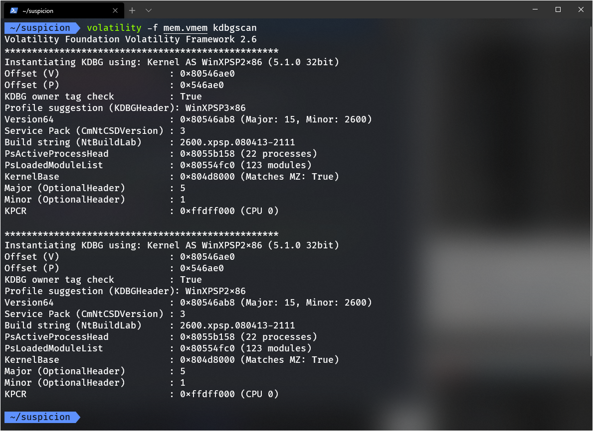

### 使用Volatility解决CTF取证类题目 ###

[官方手册](https://github.com/volatilityfoundation/volatility/wiki/Command-Reference)

以[jarvisoj 取证2](http://pan.baidu.com/s/1c2BIGLE)为例进行分析

1. 常用命令
   1. imageinfo & kdbgscan

    获取内存镜像的摘要信息,为下一步分析作铺垫(仅适用于windows内存镜像)

    `volatility -f mem.vmem imageinfo`

    

    得到`Profile`为`WinXPSP2x86, WinXPSP3x86 (Instantiated with WinXPSP2x86)`

    也可以使用`kdbgscan`

    `volatility -f mem.vmem kdbgscan`

    

   2. pslist & hivelist

    pslist列出运行的进程.如果Exit所在的一列显示了日期时间,则表明该进程已经结束

    `volatility -f mem.vmem --profile=WinXPSP2x86 pslist`

    

    hivelist列出缓存在内存中的注册表

    `volatility -f mem.vmem --profile=WinXPSP2x86 hivelist`

    

    3. filescan

    扫描内存中的文件

    `volatility -f mem.vmem --profile=WinXPSP2x86 filescan`

    4. memdump

    将进程中的所有内存驻留页面提取到单个文件中
    
    `volatility -f mem.vmem --profile=WinXPSP2x86 memdump -p [PID] -D [dump 出的文件保存的目录]`
    
    或者

    `volatility -f mem.vmem --profile=WinXPSP2x86 memdump -p 2012 --dump-dir ~/suspicion/out`
    
    (`-D DUMP_DIR, --dump-dir=DUMP_DIR`)
